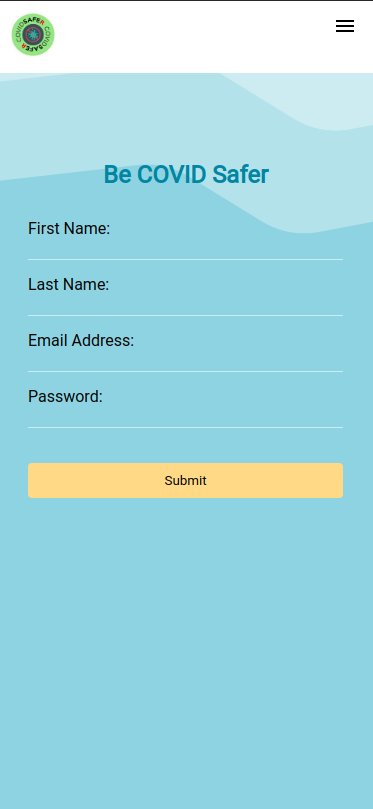
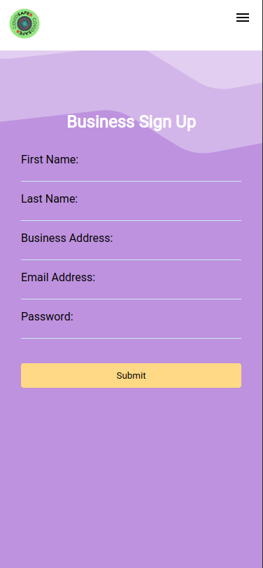
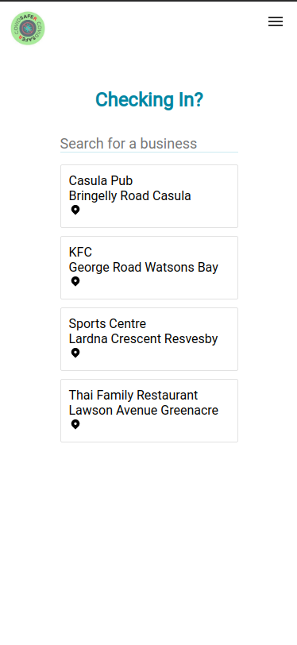
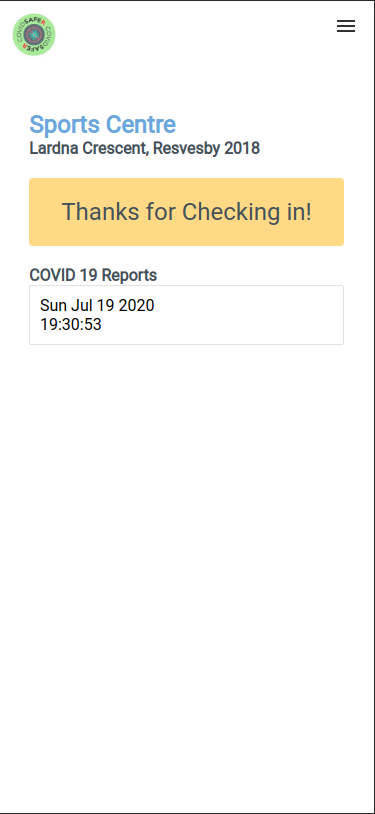
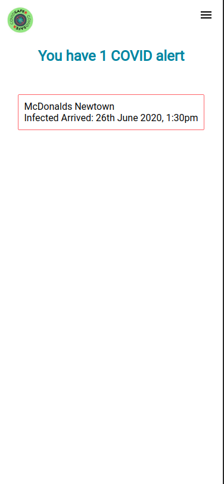
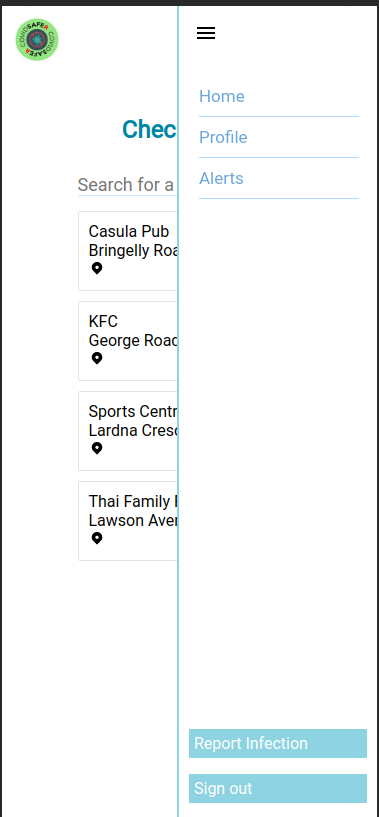

# COVID-Safer
An instant & contactless check-in app for users visiting COVID safe businesses. This application has a dual Frontend (created in React) and Backend (SailsJS).

2020 CSESoc Annual Hackathon

Created By: Angela Huang, Apurva Shukla, Chloe Li, Nelson Long

# Try it out!
1. `git clone` repo
2. `npm install` in both Frontend and Backend directories
3. `node app.js` in Backend to start the SailsJS server 
3. `npm start` in Frontend to start the React server. This will redirect you to a localhost:3000. This is optimised for mobile displays and will not work as designed on desktop (you can mimic a mobile device by going to dev tools on your browser of choice).  

*Disclaimer: This is a Minimum Viable Product, therefore you are likely to run into bugs/errors*

# Quick Demo

# Screenshots

